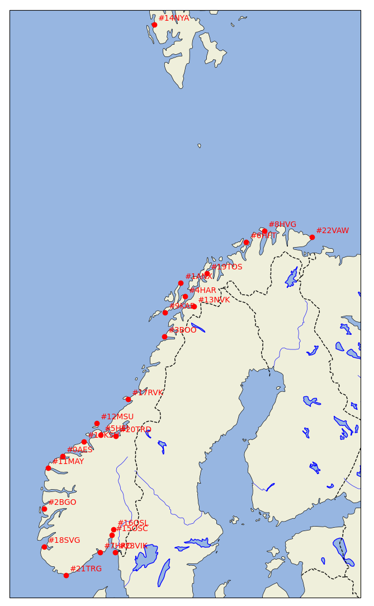
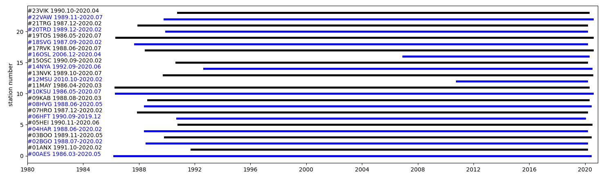
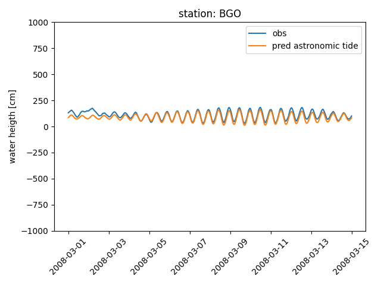

# kartverket_storm_surge_data

Interact with storm surge data from the kartverket API. This implements a simple interaction to the Kartverket API, as it is described in the ```tideapi_protocol.pdf```. All data generated through this module are directly provided by Kartverket. Their license is available at: ```https://www.kartverket.no/data/lisens/```.

## Installation

To install: add to your pythonpath. For example on my machine, this folder is at location ```/home/jrmet/Desktop/Git/kartverket_storm_surge_data/```, and the command to add to my ```.bashrc``` is:

- ```export PYTHONPATH="${PYTHONPATH}:/home/jrmet/Desktop/Git/kartverket_storm_surge_data"```

## Description

The code in the module implements a simple interaction with Kartvekets web API, following the specification in the ```tideapi_protocol.pdf```. The code makes sure that we are 'nice' to the API, by limiting request rate to max 1 request / second, limiting the size of each individual request, and caching data for later use. Building the full dataset on the period 1970-2020 can take up to a couple of days as a consequence. Once the dataset has been built and dumped as .nc4, data access is of course very quick. When building the dataset, up to typically 5 GB of http request data are cached. The final .nc4 file containing all data in binary format is about 500MB in size.

The recommended workflow is the following (all refering to the content of the ```kartverket_stormsurge``` module):

- Generate a netCDF4 dataset from API requests, using the ```script_generate_nc4_dataset.py```.
- If wanted, check perform a few random checks of the dataset generated (this was created to make sure that there were no mistakes in the netCDF4 dataset generation): ```script_check_dataset.py```.
- After this point, the data can be accessed directly from the netCDF4 dataset. For an example of interaction, see ```script_access_dataset.py```.

## Feedback / discussion / bugs

Please use the Github issue tracker at ```https://github.com/jerabaul29/kartverket_storm_surge_data/issues``` to report any issue, discuss, etc.

## Notes

This small module was developed in the context of the 'MachineOcean' project, Norwegian Meteorological Institute: ```https://machineocean.met.no/```.

## Example of resuts

The ```script_access_dataset.py``` will typically produce figures (or / and data for any use) from the Kartverket data about:

- station location:



- time extend over which the data are available for each station:



- data dump for any station over the time range spanned by the .nc4 dataset generated:

